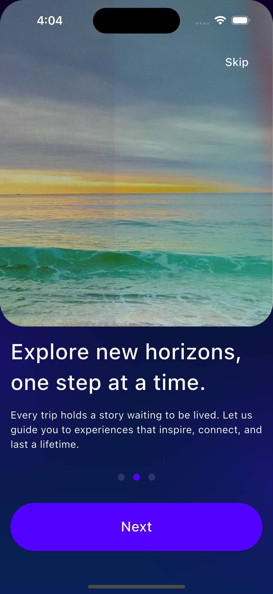
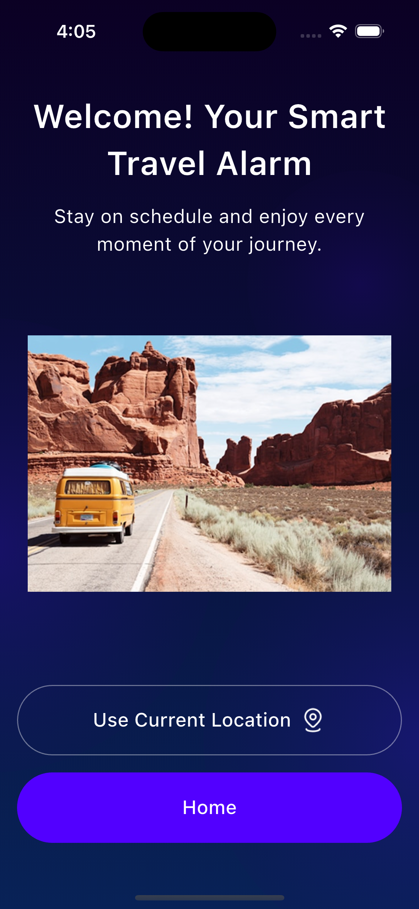
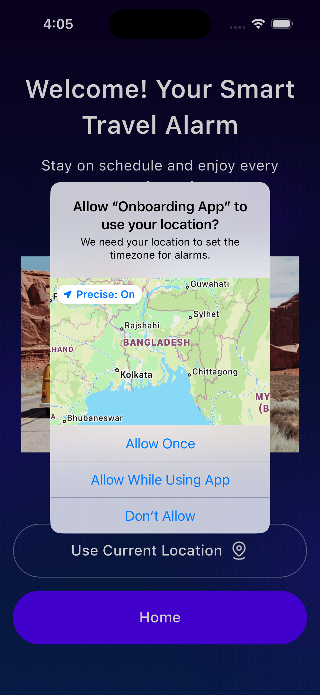
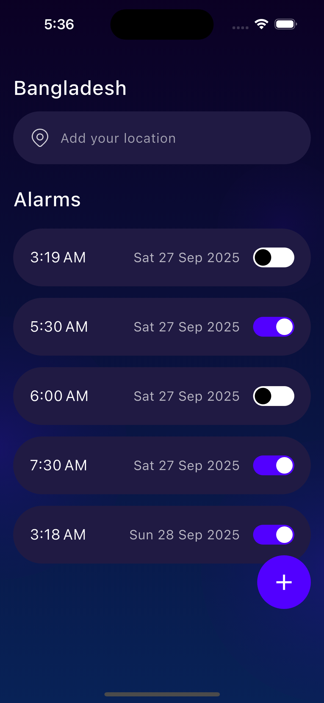

# Flutter_Onboarding_App

Flutter Onboarding App based on the provided Figma design.  
This app guides users through onboarding screens, requests location input, and allows them to create and manage alarms with toggle functionality.

---

## 1. Project Setup Instructions

Follow these steps to get the project running locally:
1. Clone the repository: git clone https://github.com/sazzad1620/Flutter_Onboarding_App.git
2. Navigate to the project directory: cd Flutter_Onboarding_App
3. Install dependencies: flutter pub get
4. Run the app: flutter run

## 2. Tools/packages used

- provider – State management
- geolocator – Get device’s current location
- geocoding – Convert coordinates into human-readable addresses
- shared_preferences – Store simple key-value data locally
- timezone – Time zone handling
- flutter_native_timezone – Get device’s native timezone
- intl – Date & time formatting
- flutter_local_notifications – Local notifications for alarms

  
## 3. Screenshorts

### Onboarding Screens

  &nbsp;&nbsp;&nbsp;
  &nbsp;&nbsp;&nbsp;
  

### Location Screens

  &nbsp;&nbsp;&nbsp;
  

### Alarm Screen

  

