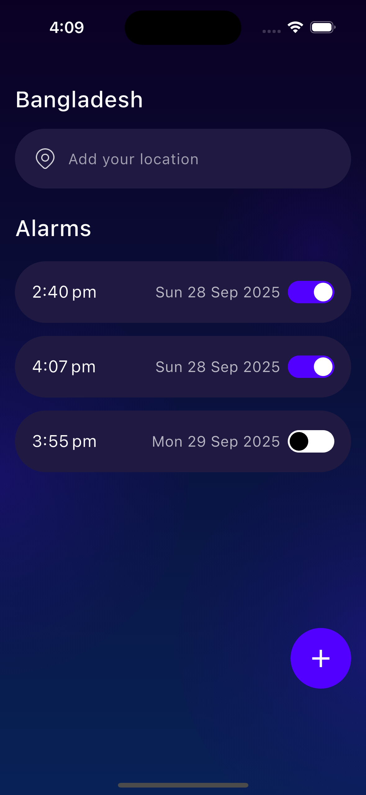
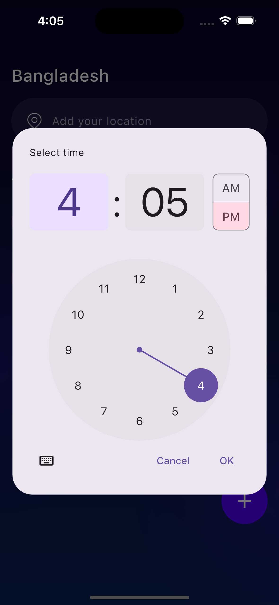
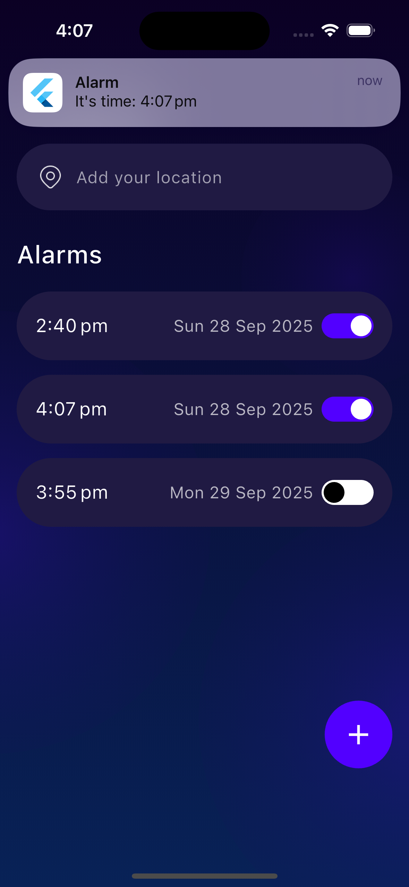
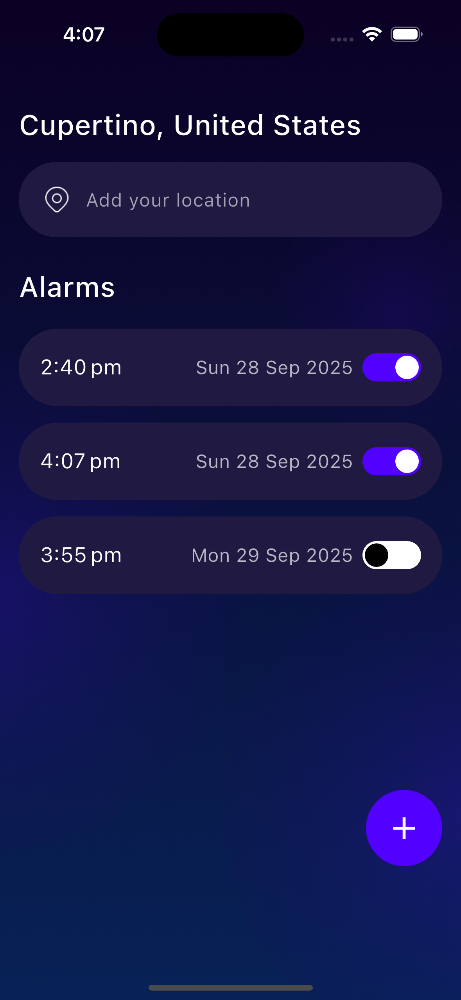

# Flutter_Onboarding_App

Flutter Onboarding App based on the provided Figma design.  
This app demonstrates onboarding screens, displays the selected location on the alarm page, and provides functionality to create and manage alarms with toggle control. Notifications are scheduled and delivered at the set alarm time, ensuring reminders trigger exactly when the alarm goes off. Additionally, swap-to-delete alarm functionality has been added to enhance the overall UX.
---

## 1. Project Setup Instructions

Follow these steps to get the project running locally:
1. Clone the repository: git clone https://github.com/sazzad1620/Flutter_Onboarding_App.git
2. Navigate to the project directory: cd Flutter_Onboarding_App
3. Install dependencies: flutter pub get
4. Run the app: flutter run

## 2. Tools/packages used

- Flutter SDK: ^3.9.0
- Provider (^6.0.5) → State management for alarms & location.
- Shared Preferences (^2.1.1) → For persisting (saving & loading) alarms locally.
- Intl (^0.18.1) → For date & time formatting (12-hour am/pm style).
- Geolocator (^10.0.0) → To access device location (used in location field).
- Geocoding (^2.1.1) → To convert coordinates into human-readable addresses.
- Flutter Local Notifications (^19.4.2) → To schedule and display alarms/notifications.
- Timezone (^0.10.1) + Flutter Timezone (^5.0.0) + Flutter Native Timezone (^2.0.0) → To handle alarm scheduling correctly with time zones.
- Fluttertoast (^8.2.1) → For showing small toast messages (e.g., confirmation).
- Cupertino Icons (^1.0.8) → iOS-style icons.

  
## 3. Screenshorts

### Onboarding Screens

  
  
  

### Location Screens

  
  

### Alarm Screen

  
  
  
  
  

### Resubmission Notes / Updates

- Notification system added: Alarms now trigger notifications at the set time.
- Updated design: One of the pages was updated to match the latest Figma design.
- UX improvement: Swap-to-delete functionality was added for alarms to enhance user experience.
- Location behavior on iOS simulator: When using the simulator without a predefined location, only the country is displayed. Selecting a predefined location shows both city and country. This might be due to simulator or map limitations.

